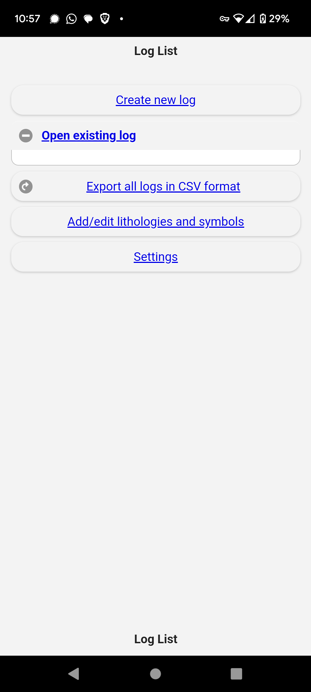
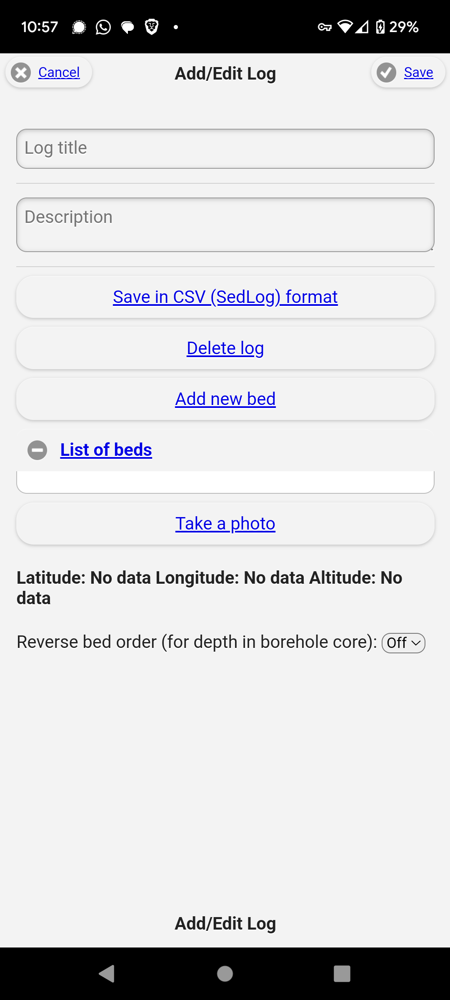
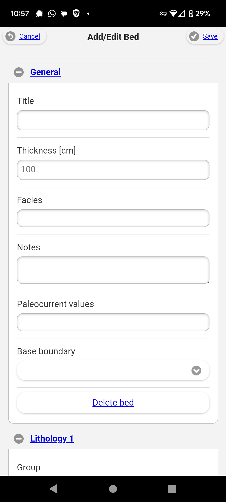
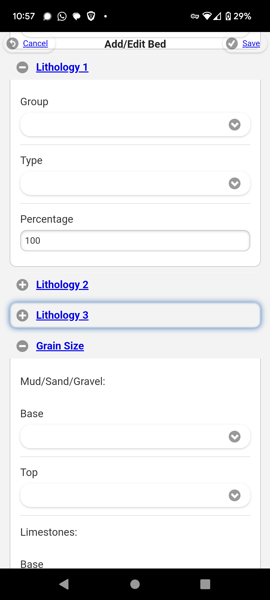
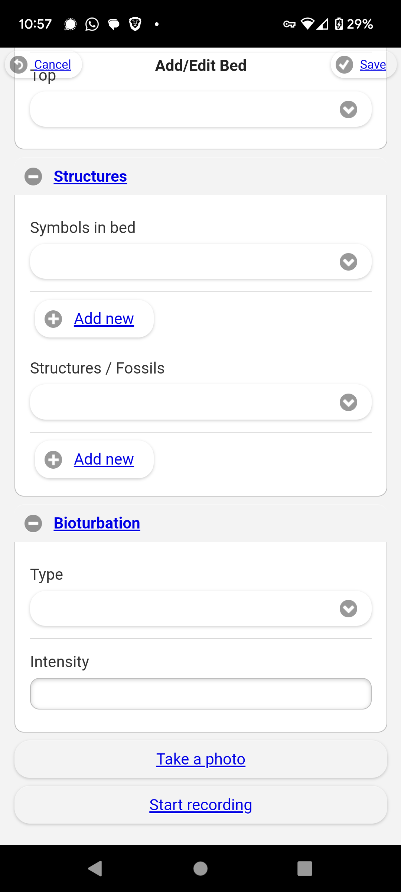
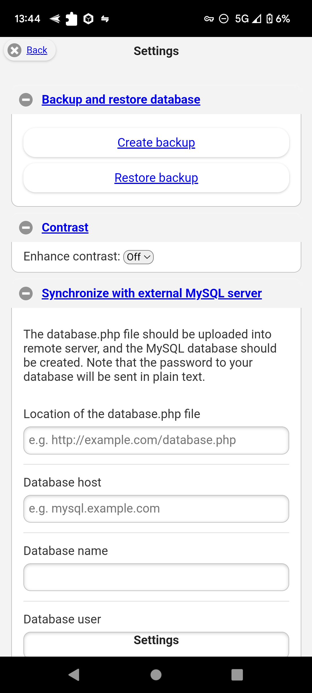

# SedMob

[](https://github.com/stark1tty/SedMob/actions/workflows/pages/pages-build-deployment)

A free and open-source web application for field geological and sedimentological core logging.

SedMob lets geologists create sedimentary logs in the field using any device with a browser. Create unlimited logs, record detailed bed-by-bed data, and export to CSV compatible with [SedLog](https://sedlog.rhul.ac.uk/) for desktop visualization.

## Features

- Create and manage multiple sedimentary log profiles with GPS metadata
- Record detailed bed data: lithology (up to 3 components), grain size (clastic and carbonate), sedimentary structures, bioturbation, boundaries, paleocurrents, and facies
- Drag-and-drop bed reordering
- CSV export compatible with SedLog
- Customizable reference data (lithologies, structures, grain sizes, boundaries)
- Pre-seeded with standard sedimentological classification schemes
- SQLite database, no external services required

## Getting Started

### Requirements

- Python 3.10+
- pip

### Installation

```bash
# Clone the repository
git clone https://github.com/stark1tty/SedMob.git
cd SedMob

# Create a virtual environment
python -m venv .venv
source .venv/bin/activate

# Install dependencies
pip install -r sedmob/requirements.txt

# Run the application
python run.py
```

The app will be available at `http://localhost:5000`.

### Running Tests

```bash
pytest
```

## Screenshots

<table>
  <tr>
    <td><br>Main Menu</td>
    <td><br>Core Details</td>
    <td><br>Core Log</td>
  </tr>
  <tr>
    <td><br>Core Log</td>
    <td><br>Core Log</td>
    <td><br>Settings Menu</td>
  </tr>
</table>

## JSON API

SedMob includes a read-only REST API at `/api` for programmatic access to your data.

| Endpoint                               | Description                     |
| -------------------------------------- | ------------------------------- |
| `GET /api/profiles`                    | List all profiles               |
| `GET /api/profiles/<id>`               | Single profile with nested beds |
| `GET /api/profiles/<id>/beds`          | All beds for a profile          |
| `GET /api/profiles/<id>/beds/<bed_id>` | Single bed detail               |

All endpoints return JSON. Example:

```bash
curl http://localhost:5000/api/profiles
```

## Roadmap

### Missing from original app (conversion gaps)

- [ ] Bed photo management — BedPhoto model, upload, display gallery, delete (original: `bedphotos` table)
- [ ] Profile photo upload — Upload/display a photo per profile (original: camera capture)
- [ ] Bulk CSV export — Export all profiles at once from the home page (original: "Export all logs in CSV format")
- [ ] Reference data rename/edit — Rename lithologies, structures, and their groups (original: `butsavesymbol`)
- [ ] Reference data group delete — Delete lithology/structure groups with cascade (original: `butdelsymbol` for groups)
- [ ] Grain size phi value storage — Store phi values alongside grain size names in bed form (original: stored both)
- [ ] Lithology percentage auto-balancing — Client-side JS to keep lit1+lit2+lit3 = 100% (original: `pagebed.js`)
- [ ] Database backup & restore — Export/import full database as downloadable file (original: SQL dump to file)
- [ ] Bed audio upload — Upload audio notes per bed (original: Cordova audio recording)
- [ ] Browser geolocation — Capture GPS coordinates on profile creation (original: `navigator.geolocation`)
- [ ] Bed direction reversal — Actually reverse bed positions when direction is toggled (original: reversed in DB)

### Future enhancements

- [ ] GPS "Get Location" button — Capture current device coordinates into Lat/Long/Alt fields on the profile form
- [ ] Variable popup descriptions — Info popups explaining each field/variable on the bed and profile forms
- [ ] Reference data descriptions — Add a description/definition field to reference data items (lithologies, structures, etc.)
- [ ] Dark mode / UI improvements
- [ ] Default menu options for standard sedimentological recording (including Tröels-Smith 1955)
- [ ] Colour recording menu
- [ ] Core metadata fields (client, project, etc.)
- [ ] Additional export options (Dropbox, email, RockWorks)
- [ ] SedLog-style graphical previews
- [ ] New sheet types: day sheets, trench pits, test pits, misc notes
- [ ] Test project

## Background

SedMob was originally developed as a Cordova-based mobile app by [Pawel Wolniewicz](https://github.com/pwlw/SedMob). This version is a rewrite as a Python/Flask web application, designed to run on any device with a browser.

## References

Wolniewicz, P. (2014). SedMob: A mobile application for creating sedimentary logs in the field. *Computers & Geosciences*, 66, 10.1016/j.cageo.2014.02.004.

## Citing SedMob

If you use SedMob in your research or publications, please cite the appropriate version:

```bibtex
% This web application version
@software{sedmob_web_2024,
  author = {stark1tty},
  title = {SedMob: Web Application for Field Geological Core Logging},
  year = {2024},
  url = {https://github.com/stark1tty/SedMob},
  note = {Python/Flask web application}
}

% Original mobile application
@software{sedmob_mobile_2014,
  author = {Wolniewicz, Pawel},
  title = {SedMob: Mobile Application for Sedimentary Logging},
  year = {2014},
  url = {https://github.com/pwlw/SedMob},
  note = {Cordova-based mobile application}
}

% Research paper
@article{wolniewicz2014sedmob,
  author = {Wolniewicz, Pawel},
  title = {SedMob: A mobile application for creating sedimentary logs in the field},
  journal = {Computers \& Geosciences},
  volume = {66},
  pages = {211--218},
  year = {2014},
  doi = {10.1016/j.cageo.2014.02.004},
  url = {https://doi.org/10.1016/j.cageo.2014.02.004}
}
```

## License

Open source. See the repository for license details.
