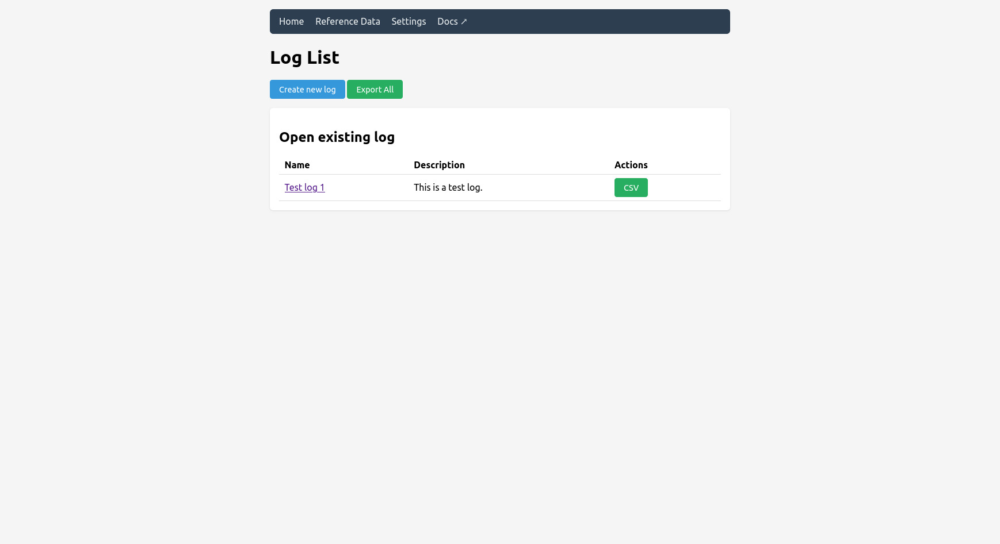
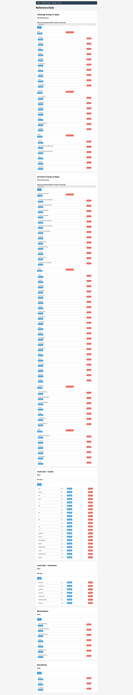
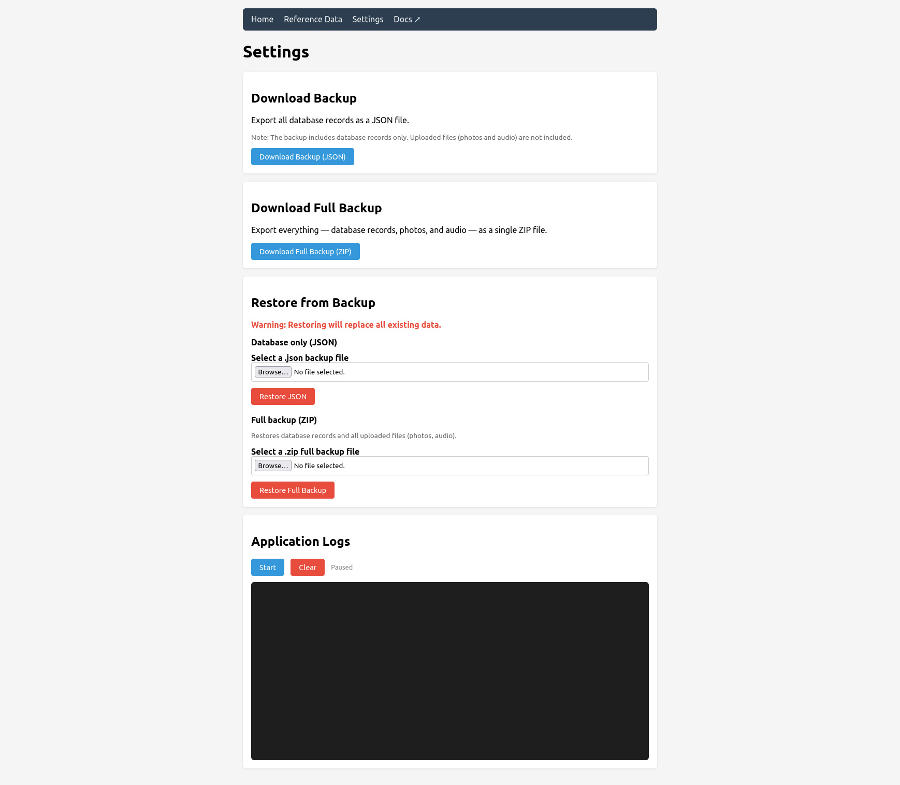

#  Gneisswork

[](https://github.com/stark1tty/Gneisswork/actions/workflows/pages/pages-build-deployment)
[](https://github.com/stark1tty/Gneisswork/actions/workflows/build-apk.yml)

A free and open-source web application for field geological and sedimentological core logging. Create sedimentary logs in the field using any device with a browser.

## Features

- Create and manage multiple sedimentary log profiles with GPS metadata
- Record detailed bed data: lithology (up to 3 components), grain size, sedimentary structures, bioturbation, boundaries, paleocurrents, and facies
- Profile and bed photo uploads, bed audio recordings
- Drag-and-drop bed reordering
- CSV export compatible with [SedLog](https://sedlog.rhul.ac.uk/), plus bulk export (ZIP)
- Customizable reference data with standard sedimentological schemes pre-loaded
- Database backup and restore (JSON or full ZIP with photos and audio), read-only JSON API
- SQLite database, no external services required

📖 Full documentation at [gneisswork.app/docs](https://gneisswork.app/docs/)

## Screenshots

<table>
  <tr>
    <td align="center"><a href="media/screenshots/home.jpg"></a><br>Home</td>
    <td align="center"><a href="media/screenshots/reference-data.jpg"></a><br>Reference Data</td>
    <td align="center"><a href="media/screenshots/settings.jpg"></a><br>Settings</td>
  </tr>
</table>

## Quick Start

### Android (Field Use)

> ⚠️ **Known Issue:** The Android APK is currently crashing on startup. This is being actively investigated. The web app (desktop/browser) works fine in the meantime.

Download the latest APK from the [Releases page](https://github.com/stark1tty/Gneisswork/releases). Install it, and the app runs completely offline — Python, Flask, and SQLite are all bundled in.

📖 [Building from source](https://gneisswork.app/docs/ANDROID_BUILD.html)

### Web App

```bash
git clone https://github.com/stark1tty/Gneisswork.git
cd Gneisswork
python run.py
```

`run.py` automatically installs dependencies from `sedmob/requirements.txt` on startup. No virtual environment setup needed for a quick start, though one is recommended for development (see [Getting Started](https://gneisswork.app/docs/getting-started.html)).

Open `http://localhost:5000`.

### Docker

```bash
git clone https://github.com/stark1tty/Gneisswork.git
cd Gneisswork
docker compose up -d
```

📖 [Getting Started guide](https://gneisswork.app/docs/getting-started.html) for full details including configuration and testing.

## Documentation

| Topic                                                               | Description                                  |
| ------------------------------------------------------------------- | -------------------------------------------- |
| [Getting Started](https://gneisswork.app/docs/getting-started.html) | Installation, configuration, Docker, testing |
| [Web UI Guide](https://gneisswork.app/docs/web-ui-guide.html)       | Using the web interface                      |
| [API Reference](https://gneisswork.app/docs/api-reference.html)     | Read-only REST API at `/api`                 |
| [Data Models](https://gneisswork.app/docs/data-models.html)         | Database schema                              |
| [CSV Export](https://gneisswork.app/docs/csv-export.html)           | Export format and SedLog compatibility       |
| [Reference Data](https://gneisswork.app/docs/reference-data.html)   | Customizing lithologies and structures       |
| [Architecture](https://gneisswork.app/docs/architecture.html)       | Technical overview                           |
| [Contributing](https://gneisswork.app/docs/contributing.html)       | Development workflow                         |
| [Roadmap](https://gneisswork.app/docs/roadmap.html)                 | Planned features and progress                |

## Background

Originally developed as a Cordova mobile app by [Pawel Wolniewicz](https://github.com/pwlw/SedMob), described in:

> Wolniewicz, P. (2014). SedMob: A mobile application for creating sedimentary logs in the field. *Computers & Geosciences*, 66, 211-218. [doi:10.1016/j.cageo.2014.02.004](https://doi.org/10.1016/j.cageo.2014.02.004)

This version is a Python/Flask rewrite designed to run on any device with a browser.

📖 [Citing Gneisswork](https://gneisswork.app/docs/citing.html) — BibTeX entries for academic use.

## License

[GNU General Public License v2.0](LICENSE) (or later), the same license as the original [SedMob](https://github.com/pwlw/SedMob) project.
