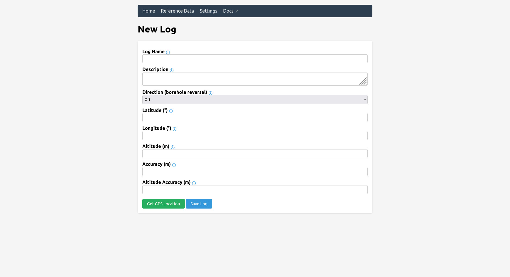
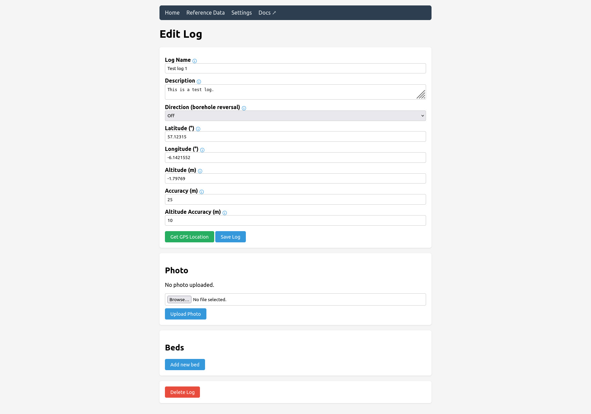
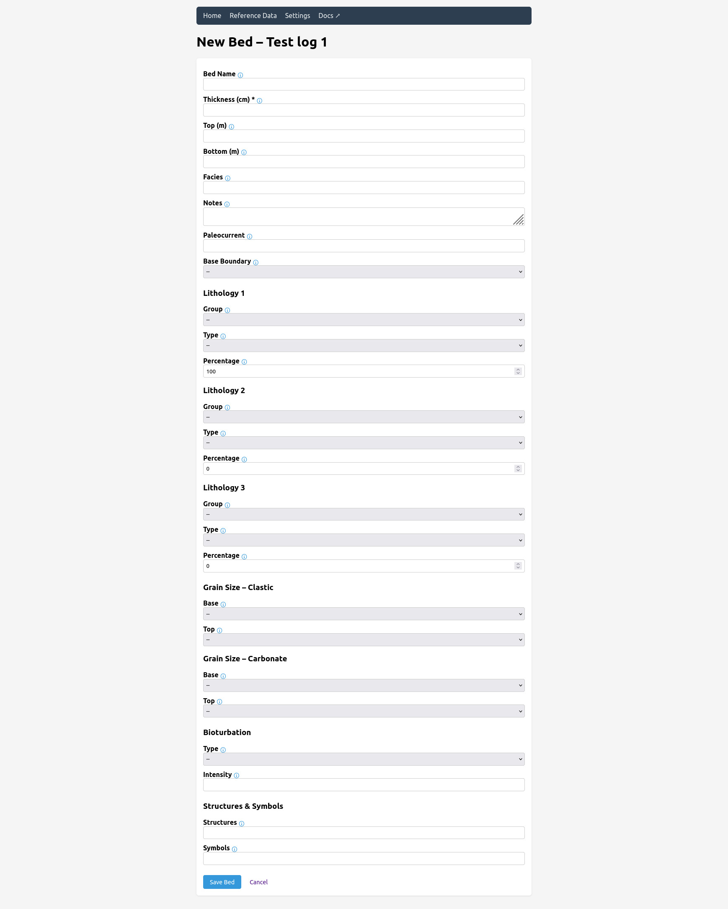

# Gneisswork Documentation

Welcome to the Gneisswork documentation! Choose a topic from the navigation below.

## Quick Links

- [Getting Started](getting-started.html) — Installation and first steps
- [Web UI Guide](web-ui-guide.html) — Using the web interface
- [API Reference](api-reference.html) — REST API endpoints
- [Data Models](data-models.html) — Database schema and models
- [CSV Export](csv-export.html) — Export format and compatibility
- [Reference Data](reference-data.html) — Customizing lithologies and structures
- [Architecture](architecture.html) — Technical overview
- [Contributing](contributing.html) — How to contribute
- [Roadmap](roadmap.html) — Planned features and progress
- [Citing Gneisswork](citing.html) — BibTeX entries and references
- [Android APK Build](ANDROID_BUILD.html) — Building the Android APK
- [Legacy Mobile App](legacy-mobile-app.html) — Original Cordova app history

## Overview

<table>
  <tr>
    <td align="center"> Home</td>
    <td align="center"> Reference Data</td>
    <td align="center"> Settings</td>
  </tr>
  <tr>
    <td align="center"> New Log</td>
    <td align="center"> Edit Log</td>
    <td align="center"> New Bed</td>
  </tr>
</table>

Gneisswork is a free and open-source web application for field geological and sedimentological core logging. It's designed to help geologists create detailed sedimentary logs in the field using any device with a browser.

### Key Features

- Create and manage multiple sedimentary log profiles
- Record detailed bed-by-bed data
- Profile and bed photo uploads with gallery display
- Bed audio recording uploads
- Drag-and-drop bed reordering
- CSV export compatible with SedLog, plus bulk export (ZIP)
- Customizable reference data
- Browser geolocation for GPS coordinate capture
- Database backup and restore (JSON or full ZIP with photos and audio)
- Read-only JSON API for programmatic access
- No internet connection required

### Technology Stack

- **Backend**: Python 3.10+, Flask 3.0+
- **Database**: SQLite with Flask-SQLAlchemy 3.1+
- **Frontend**: HTML5, CSS3, vanilla JavaScript
- **Testing**: pytest, pytest-flask, hypothesis

## Getting Help

- **Issues**: Report bugs on [GitHub Issues](https://github.com/stark1tty/Gneisswork/issues)
- **Website**: [gneisswork.app](https://gneisswork.app)
- **Main Repository**: [github.com/stark1tty/Gneisswork](https://github.com/stark1tty/Gneisswork)
